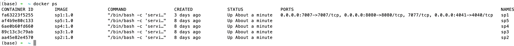
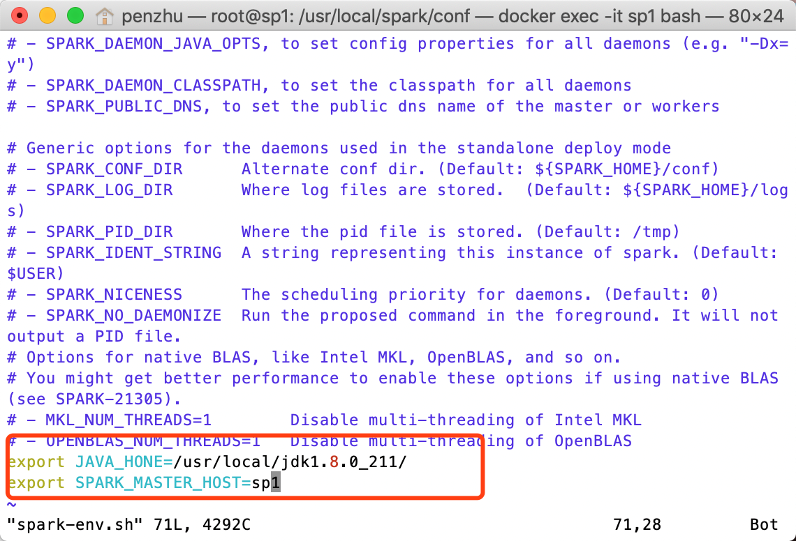
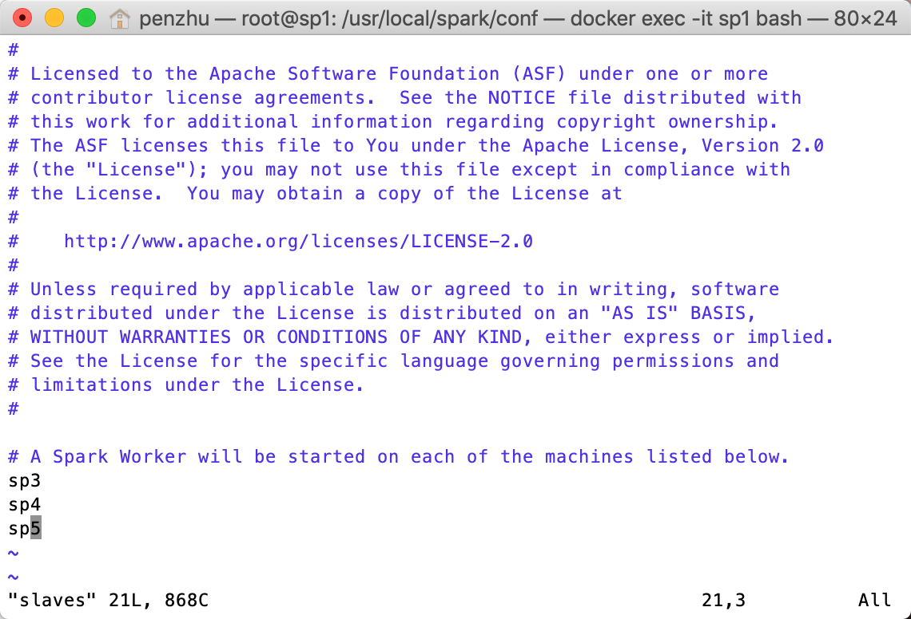
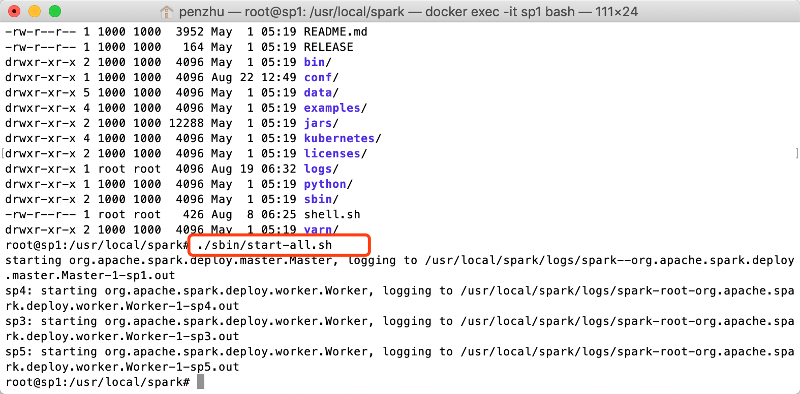
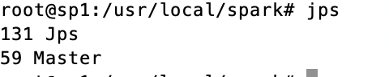
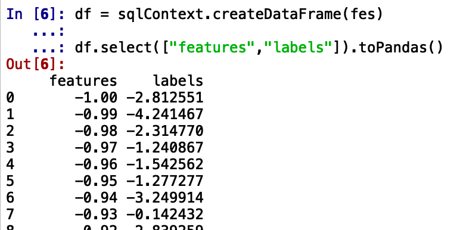
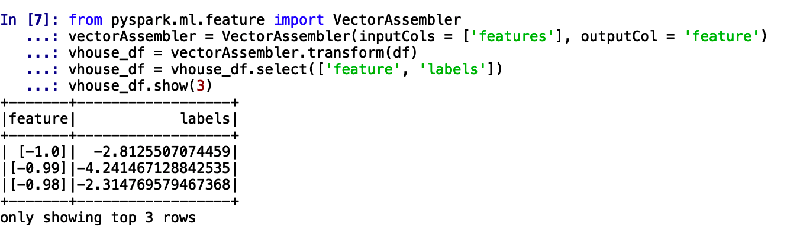
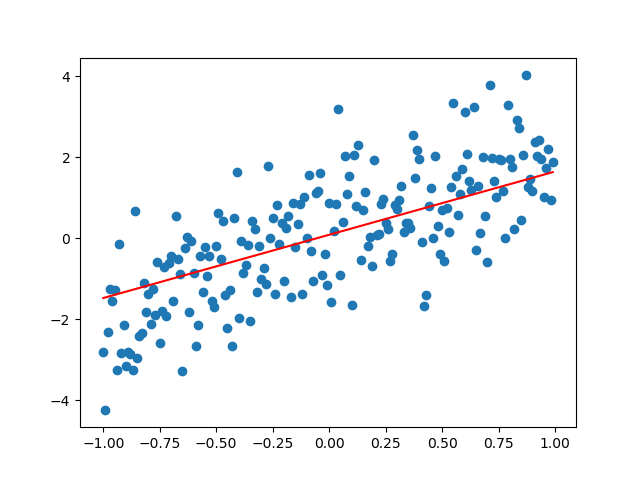
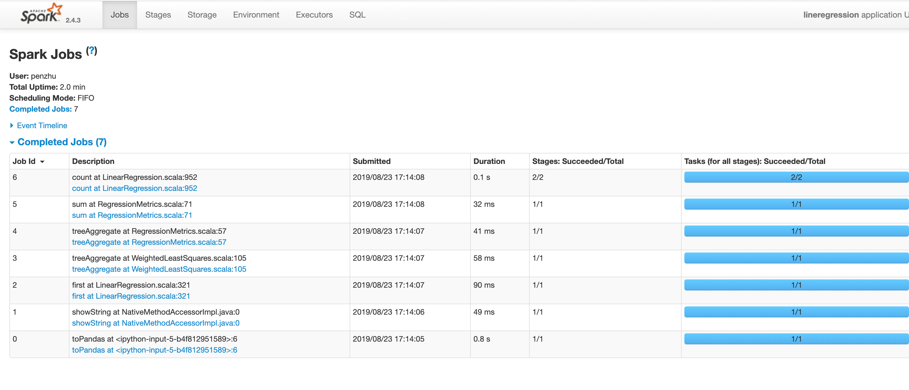

# Linear model training based on Spark
-- author: zhupc
-- 感谢老铁zhupc写出这么好的**实战教程**，大家从中一定能受益颇多

## MapReduce使用总结
最开始接触分布式计算框架的是Hadoop中的MapReduce,虽然开发起来很复杂（Map与Reduce都要有相应的实现类）但是我也成功的启动了第一个“Hello word”（word count）。

由于MapReduce每个步骤都要将中间结果存到磁盘中，而且会将job jar 包分发到每个相关的Datanode上，虽然我的Txt文件不到1M, 但是启动计算加上返回结果的时间大概也有40秒左右，还能忍，毕竟是怀揣着我将要处理TB级别数据的梦想。

## Spark机器学习开发
Spark作为分布式计算框架，采用的是一种基于内存的计算，减少了反复读取磁盘的数次，另外还提供了除了map与reduce更多的操作。这无疑是提供了最好的MapReduce替代品。然而最吸引我的不是spark的mapreduce有多么的快，而是spark集成了Machine Learning packages。

一般情况下没有什么不是一块显卡解决不了的问题，如果有就两块。

但是spark提供了另外一种基于分布式计算训练模型的思路。与之前的配置Kafka集群类似，大多数集群都会依赖zookeeper,这里为了简洁，配置spark的standalone模式集群。

## 基于docker搭建spark集群环境
本文依旧基于docker来配置集群环境。基于docker配置spark运行环境的内容这里不再介绍，基本与前文配置kafka集群类似，配置jdk,spark包，以及相关的环境变量。

本文创建5个spark容器，由于spark集群中，一个节点可以通过ssh将其他节点调用，所以在创建容器时候需要添加额外的命令(service ssh start)容器启动同时开启ssh服务，并且我们将spark需要用的几个接口也对外暴露给宿主机。

```
docker run -it --network=backend --name=sp1 -p 8080:8080 -p 7007:7007 -p 4041:4040  --hostname=sp1 -d   sp1:1.0  /bin/bash -c 'service ssh start  && /bin/bash'
```
 
容器创建好了，我们使用简单的shell命令一次性启动所有容器

```
for I in {1..5};do docker start sp$i;done;
```
 
查看容器启动状态 
```
docker  ps 
```



现在已经配置好所有spark相关环境，下面配置spark的standalone模式。
配置spark
拷贝spark脚本文件
cp spark-env.sh.template spark-env.sh 

配置standalone模型，指定master与slaves, 编辑spark-env.sh与slaves文件



启动spark集群


 
Jps查看发现sp1已经是master节点


 
 ## spark体验ml神奇之旅
 
计算环境搭建完毕，下面开始体验ML的神奇之旅，spark提供了`Scala`、`java`、`python`接口，毫无疑问`python`作为最方便的语言，本文选用`python`作为实验语言（据说scala能够跟spark无缝集成，who care about it?）

模型训练

### 1、导入需要的包
```
from pyspark import SparkConf, SparkContext
from pyspark.sql import SQLContext
from pyspark.ml.regression import LinearRegression
import numpy as np
import pandas as pd
```

### 2、造数据，y=2x+biases
```
features=[i/100. for i in range(-100,100)]
labels=[2*features[i]+np.random.normal() for i in range(len(features))]
features=np.atleast_2d(np.array(features)).reshape([-1,1])
labels=np.atleast_2d(np.array(labels)).reshape([-1,1])
```

### 3、合并矩阵
```
matrix=np.hstack([features,labels])
由于spark的dataframe格式与pandas可以直接转换，所以将numpy格式转为pandas
```

### 4、数据格式
```
fes=pd.DataFrame(data=matrix,columns=["features","labels"])
```

### 5、指定集群地址
```
sc= SparkContext( 'local', 'lineregression')
sqlContext = SQLContext(sc)
```

### 6、转换数据并查看数据
```
df = sqlContext.createDataFrame(fes)

df.select(["features","labels"]).toPandas()
```



### 7、将df转换为spark模型训练数据格式，实际上也就是将feature改为数组
 


### 8、划分数据集0.9与0.1，并打印coefficients与intercept
```
lr = LinearRegression(featuresCol = 'feature', labelCol='labels', maxIter=10, regParam=0.3, elasticNetParam=0.8)
lr_model = lr.fit(vhouse_df.randomSplit([0.9,0.1])[0])
print("Coefficients: " + str(lr_model.coefficients))
print("Intercept: " + str(lr_model.intercept))
```

### 9、绘制图像，查看拟合效果
```
a=float(str(lr_model.coefficients[0]))
b=float(str(lr_model.intercept))
import matplotlib.pyplot as plt

plt.scatter(matrix[:,0], matrix[:,1])

plt.plot(matrix[:,0],a*matrix[:,0]+b,color='red')
```



### 10、输入 http://localhost:4040查看job运行状况


 
## 总结
总体来说体验还是蛮新鲜的

## 完整代码

[spark-ml-linear-regression-demo 完整代码](./spark-ml-linear-regression-demo.py)

## 参考：

1、https://towardsdatascience.com/building-a-linear-regression-with-pyspark-and-mllib-d065c3ba246a

2、https://spark.apache.org/docs/2.2.0/ml-classification-regression.html#linear-regression


